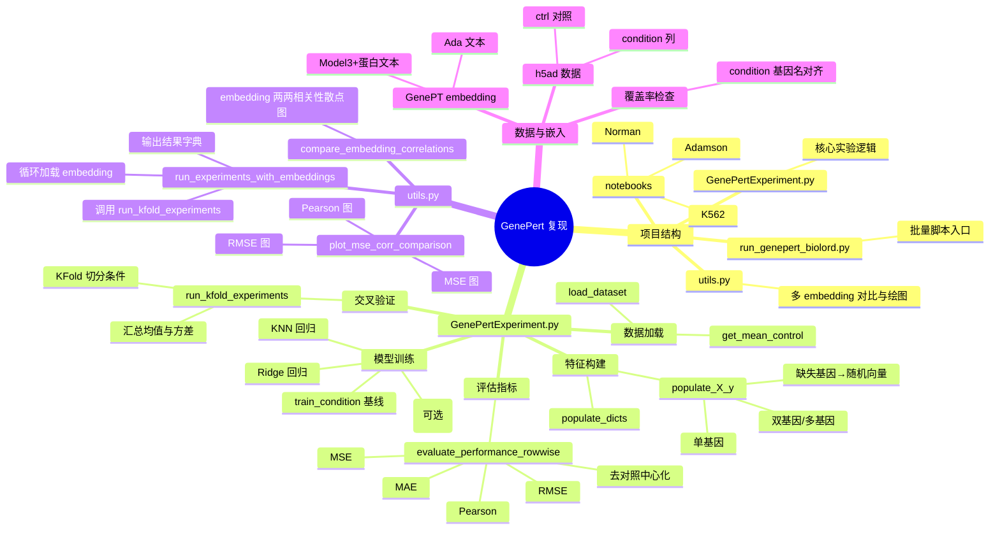

```mermaid
mindmap
  root((GenePert 复现))
    项目结构
      GenePertExperiment.py
        核心实验逻辑
      utils.py
        多 embedding 对比与绘图
      notebooks
        K562
        Adamson
        Norman
      run_genepert_biolord.py
        批量脚本入口
    GenePertExperiment.py
      数据加载
        load_dataset
        get_mean_control
      特征构建
        populate_dicts
        populate_X_y
          单基因
          双基因/多基因
          缺失基因→随机向量
      评估指标
        evaluate_performance_rowwise
          RMSE
          MSE
          MAE
          Pearson
          去对照中心化
      模型训练
        train_condition 基线
        Ridge 回归
        KNN 回归
        MLP(可选)
      交叉验证
        run_kfold_experiments
          KFold 切分条件
          汇总均值与方差
    utils.py
      run_experiments_with_embeddings
        循环加载 embedding
        调用 run_kfold_experiments
        输出结果字典
      plot_mse_corr_comparison
        MSE 图
        RMSE 图
        Pearson 图
      compare_embedding_correlations
        embedding 两两相关性散点图
    数据与嵌入
      h5ad 数据
        condition 列
        ctrl 对照
      GenePT embedding
        Ada 文本
        Model3+蛋白文本
      覆盖率检查
        condition 基因名对齐

```